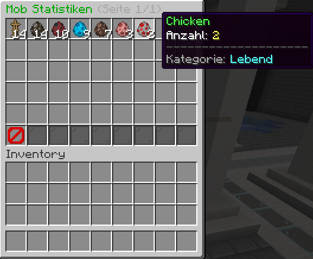
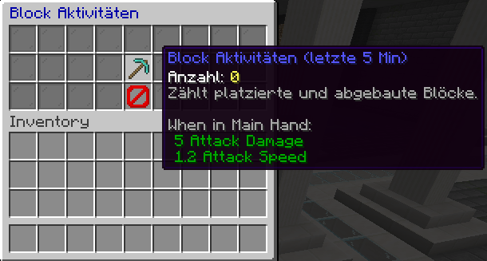
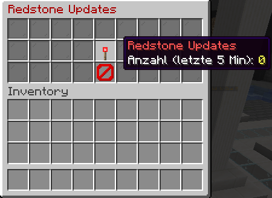
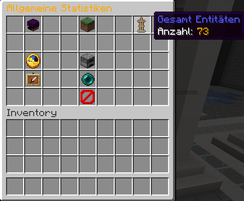
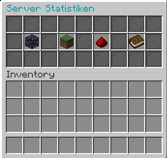

# ServerStats Plugin für Spigot/Paper

Ein umfassendes Spigot/Paper-Plugin zur Anzeige detaillierter Serverstatistiken über eine benutzerfreundliche GUI. Behalte den Überblick über Mobs, Blockaktivitäten, Redstone-Nutzung, Spieler, Welten und wichtige Performance-Metriken deines Minecraft-Servers.

---

## ✨ Features

*   **Intuitive GUI:** Alle Statistiken sind über einen einfachen Befehl und eine übersichtliche grafische Oberfläche zugänglich.
*   **Mob-Statistiken:**
    *   Anzeige aller geladenen Mob-Typen.
    *   Anzahl pro Mob-Typ.
    *   Paginierung für eine große Anzahl verschiedener Mob-Typen.
    *   
*   **Block-Aktivitäten:**
    *   Anzahl der platzierten und abgebauten Blöcke in den letzten 5 Minuten.
    *   
*   **Redstone-Updates:**
    *   Anzahl der Redstone-Updates in den letzten 5 Minuten.
    *   
*   **Allgemeine Serverinformationen:**
    *   Anzahl der Online-Spieler.
    *   Anzahl der geladenen Welten und deren Namen.
    *   Gesamtzahl der Item-Entitäten.
    *   Gesamtzahl aller Entitäten.
    *   Anzahl der geladenen Chunks.
    *   
*   **Performance-Metriken:**
    *   Aktuelle Server-TPS (Ticks Per Second).
    *   RAM-Auslastung (Maximal, Zugewiesen, Genutzt).
    *   Durchschnittlicher Spieler-Ping.
*   **Einfache Navigation:** "Zurück"-Buttons in allen Untermenüs für eine flüssige Bedienung.
*   **Berechtigungsgesteuert:** Zugriff auf die Statistiken kann über eine Permission kontrolliert werden.

---

## 🚀 Installation

1.  Lade die neueste `DevBewerbung-X.X.X.jar` von der [[Releases-Seite](https://github.com/1o0co0q1ix/ServerStats/releases/tag/ServerStats-0.1.0-Alpha)].
2.  Platziere die JAR-Datei in den `plugins`-Ordner deines Spigot/Paper-Servers.
3.  Starte oder lade deinen Server neu (`/reload` oder `/restart`).
4.  Das Plugin ist nun aktiv!

---

## 🛠️ Benutzung

*   **Hauptbefehl:** `/serverstats` (Aliase: `/sstats`, `/servstats`)
    *   Öffnet die Haupt-GUI, von der aus du zu den verschiedenen Statistik-Kategorien navigieren kannst.
    *   

*   **Navigation:**
    *   Klicke auf die verschiedenen Items in der Haupt-GUI, um die jeweiligen Detailansichten zu öffnen.
    *   Benutze den "Zurück"-Button (oft ein Pfeil oder eine Barriere), um zum vorherigen Menü zurückzukehren.
    *   In der Mob-Statistik-GUI gibt es Pfeile zum Blättern durch die Seiten, falls viele Mob-Typen vorhanden sind.

---

## ⚙️ Konfiguration

Aktuell benötigt das Plugin keine separate Konfigurationsdatei. Alle Einstellungen sind fest im Code verankert.

---

## 🔑 Berechtigungen

*   `serverstats.use`
    *   Erlaubt Spielern die Benutzung des `/serverstats` Befehls und den Zugriff auf die Statistik-GUI.
    *   Standard: OP-Spieler (kann je nach Permissions-Plugin variieren).

---

## 📸 Screenshots

Hier eine kleine Vorschau der GUIs:

**Hauptmenü:**

**Mob-Übersicht:**

**Allgemeine Statistiken:**

---

## ❗ Bekannte Probleme / Geplante Features

*   **Bekannte Probleme:**
    *   keine bekannten Probleme zum aktuellen Zeitpunkt.
*   **Geplante Features:**
    *   keine spezifischen Features geplant, aber zukünftige Updates könnten neue Statistiken oder verbesserte GUI-Elemente beinhalten.

---

## 🤝 Mitwirken

Wenn du Fehler findest oder Verbesserungsvorschläge hast, erstelle bitte ein [Issue]([https://github.com/1o0co0q1ix/ServerStats/issues]) auf GitHub (falls vorhanden).

Pull Requests sind ebenfalls willkommen!

---

*Entwickelt von [locoqlix](https://github.com/1o0co0q1ix)*
